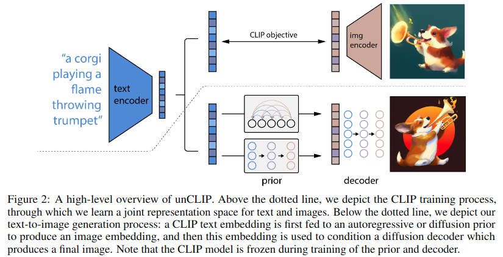

+++
author = "Yubao"
title = "CLIP"
date = "2024-08-31"
description = "clip"
tags = [
    "clip",
]
categories = [
    "clip",
]
series = ["series_clip"]
aliases = ["aliases_clip"]
image = "image-20240831112921213.png"
+++

# Related Papers

## 2021 CLIP

[1] A. Radford *et al.*,  Learning Transferable Visual Models From Natural Language Supervision,  Feb. 26, 2021, *arXiv*: arXiv:2103.00020. 

- CLIP:= Contrastive Language-Image Pre-Training

- 把计算机视觉与NLP融合在一起

- 数据来自互联网

- 图像分类器

## 2022 VQGAN-CLIP

[1] K. Crowson *et al.*,  VQGAN-CLIP: Open Domain Image Generation and Editing with Natural Language Guidance,  Sep. 04, 2022, *arXiv*: arXiv:2204.08583. 

- https://github.com/nerdyrodent/VQGAN-CLIP

## ActionCLIP

[1] M. Wang, J. Xing, and Y. Liu,  ActionCLIP: A New Paradigm for Video Action Recognition,  Sep. 17, 2021, *arXiv*: arXiv:2109.08472. 

## CLIP-EVENT

[1] M. Li *et al.*,  CLIP-Event: Connecting Text and Images with Event Structures,  in *2022 IEEE/CVF Conference on Computer Vision and Pattern Recognition (CVPR)*, New Orleans, LA, USA: IEEE, Jun. 2022, pp. 16399 16408. doi: [10.1109/CVPR52688.2022.01593](https://doi.org/10.1109/CVPR52688.2022.01593).

- https://github.com/limanling/clip-event

## Hierarchical Text-Conditional Image Generation with CLIP Latents

[1] A. Ramesh, P. Dhariwal, A. Nichol, C. Chu, and M. Chen,  Hierarchical Text-Conditional Image Generation with CLIP Latents,  Apr. 12, 2022, *arXiv*: arXiv:2204.06125.

- https://github.com/lucidrains/DALLE2-pytorch

