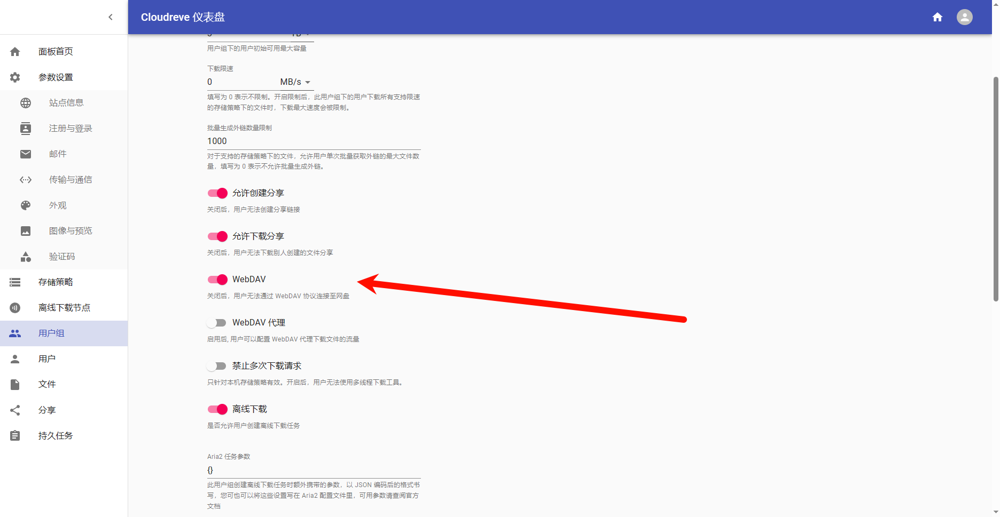

# 使用Docker安装


- doccker compose: 

https://github.com/cloudreve/cloudreve/blob/master/docker-compose.yml

- build and run
```sh
docker-compose build
docker-compose up
```
- WebDAV配置



- 设置docker反向代理与SSL证书


# Cloudereve 手动配置
- 参考配置: https://docs.cloudreve.org/zh/overview/quickstart
  
- 启动

```sh
./cloudreve
```

- 注册用户

  管理员用户与密码是什么？ 第一个注册的用户为管理员用户

- 设置域名

- 通过配置文件设置SSL秘钥（不推荐， 建议使用下面docker配置方式）

```sh
; SSL 相关
[SSL]
; SSL 监听端口，默认为 443
Listen = :443
; 证书路径，默认为空
CertPath =/www/server/panel/vhost/cert/cloud.milaiai.com/fullchain.pem
; 私钥路径，默认为空
KeyPath =/www/server/panel/vhost/cert/cloud.milaiai.com/privkey.pem
```

# Questions

- 如果端口被占用

```sh
./cloudreve
[Info]   2025-07-03 13:44:22 [/home/vsts/work/1/s/application/application.go:158] Listening to ":5212"
[Error]  2025-07-03 13:44:22 [/home/vsts/work/1/s/cmd/server.go:45] Failed to start server: failed to listen to ":5212": listen tcp :5212: bind: address already in use
```

​查看占用情况

```sh
> sudo netstat -tulpn|grep 5212
tcp        0      0 0.0.0.0:5212            0.0.0.0:*               LISTEN      3065/docker-proxy
tcp6       0      0 :::5212                 :::*                    LISTEN      3071/docker-proxy-
```