+++
author = "Yubao"
title = "对比学习"
date = "2025-07-12"
description = "对比学习"
tags = [
    "对比学习",
]
image = "https://framerusercontent.com/images/CyT6g2GBN9rfNv0o4wOhSPTlwm4.jpeg"
+++

# Introduction

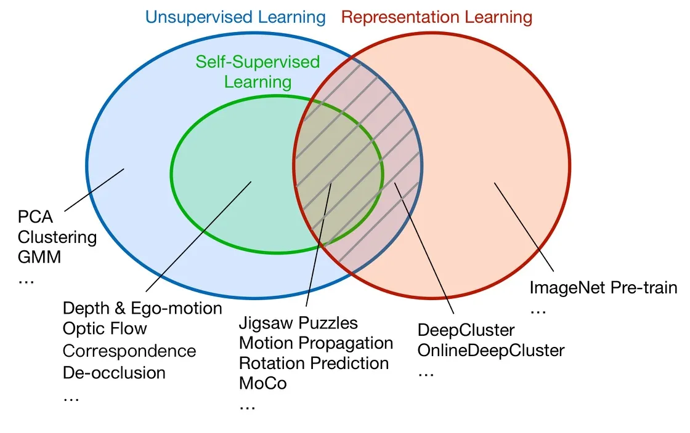

对比学习是一种为机器学习模型**描述相似和不同事物的任务的方法**。它试图教机器区分相似和不同的事物。

**对比学习框架**

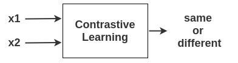

- 对比学习不需要标签，自动就能学。
- 不是分类任务
- 目标是判断是不是同一个（是不是自己），自己与自己互为正样本，自己与其它互为负样本
- 训练时是需要负样本的，不然可能会导致模型坍塌
- 对比学习可以用来提特征
- 对比学习相比有监督的学习，其泛化能力更强一些

# Sourece Codes

- https://github.com/lucidrains/DALLE2-pytorch

# Papers

## 2020 SimCLR

[1] T. Chen, S. Kornblith, M. Norouzi, and G. Hinton,  A Simple Framework for Contrastive Learning of Visual Representations,  Jun. 30, 2020, *arXiv*: arXiv:2002.05709. https://github.com/google-research/simclr

**SimCLR：一个简单的视觉表示对比学习框架，不仅比以前的工作更出色，而且也更简单，既不需要专门的架构，也不需要储存库。**

**SimCLR Framework**

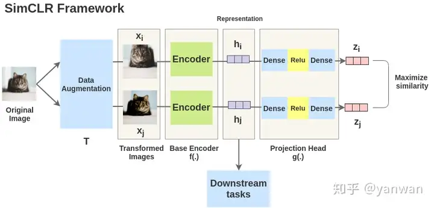

数据增强：可以是旋转、平移、加噪声、裁减、改变颜色等等。
$x_i$: 是随机裁减之后的
$x_j$: 改变颜色并平移
两者均是由原始数据变换过来的，它们都是正样本。

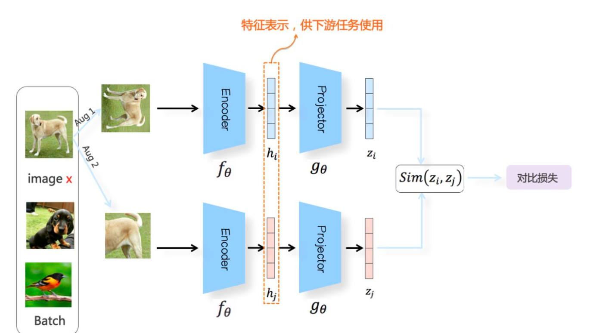

下图可以得到两对正样本，四对负样本。

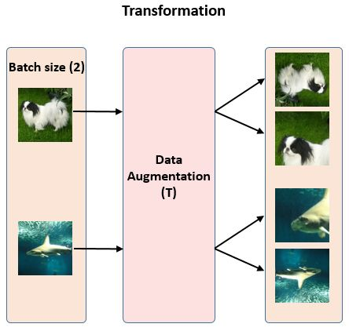

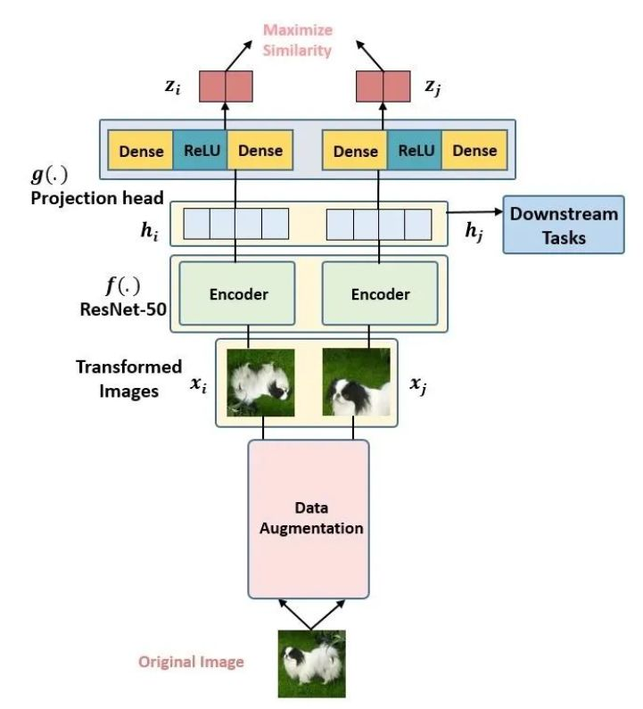

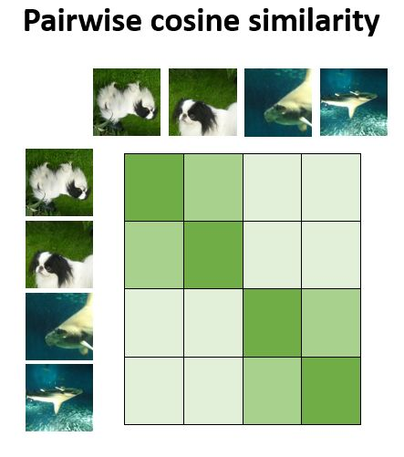

删除对角线，对角线不需要计算，不需要训练

**损失函数**

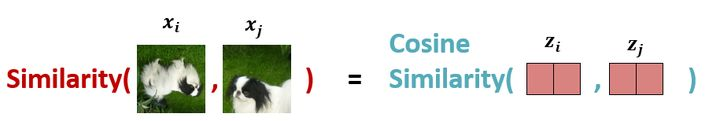

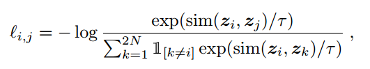

分子是考虑同类，分母是异类

$\tau$: 是个小于1的数，除以小数，数值会放大

**性能：**

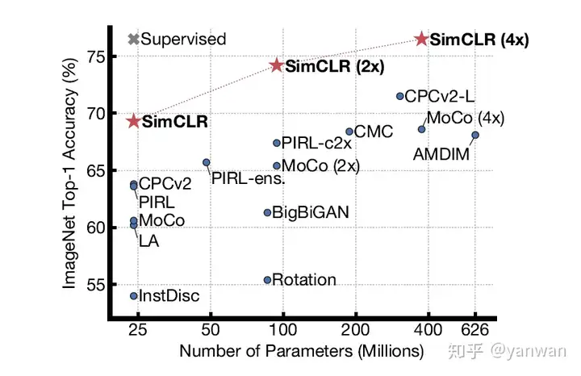

## SimCLRv2

[1] T. Chen, S. Kornblith, K. Swersky, M. Norouzi, and G. Hinton,  Big Self-Supervised Models are Strong Semi-Supervised Learners,  Oct. 25, 2020, *arXiv*: arXiv:2006.10029. 

- 模型更大
- 加了蒸馏

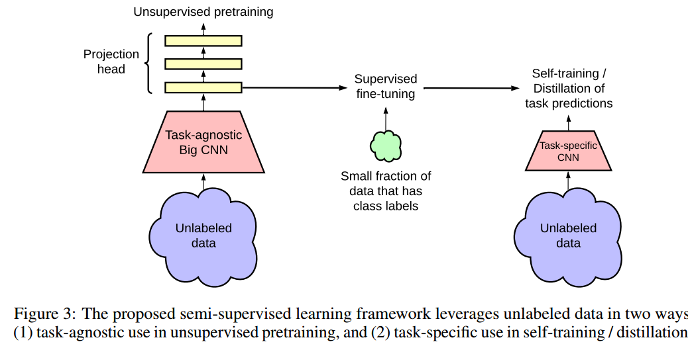

## 2020 Contrastive Multiview Coding

[1] Y. Tian, D. Krishnan, and P. Isola,  Contrastive Multiview Coding,  Dec. 18, 2020, *arXiv*: arXiv:1906.05849. 

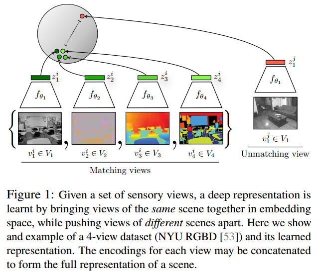

## 2020 BYOL

[1] J.-B. Grill *et al.*,  Bootstrap your own latent: A new approach to self-supervised Learning,  Sep. 10, 2020, *arXiv*: arXiv:2006.07733. 

不需要负样本也能做对比学习

虽然没有显式的使用负样本，但是在BN模块的计算中使用了负样本，如果将BN去掉，模型就会崩塌。

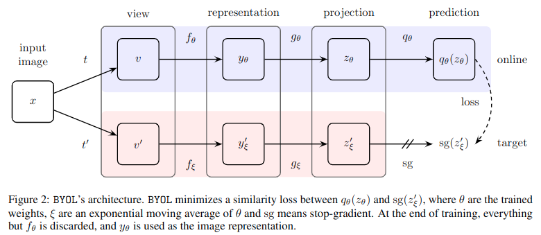

## 2022 SimCSE

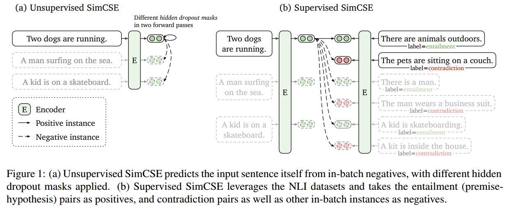

使用Dropout来生成正样本

# References

- [对比学习+多模 1小时居然就搞懂多模态3D目标检测和对比学习](https://www.bilibili.com/video/BV1jW421R7pz/?spm_id_from=333.337.search-card.all.click&vd_source=f6aa186edd20e449545aecf6d36f2e08)

- [SimCLR-对比学习框架](https://www.cnblogs.com/BlairGrowing/p/14852361.html)

- [CSDN-ICML 2020对比学习论文解读](https://blog.csdn.net/qq_43827595/article/details/127218736)

- [zhihu-SimCLR](https://zhuanlan.zhihu.com/p/197802321)

