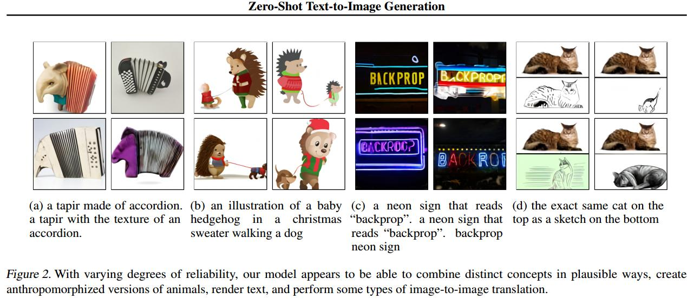

+++
author = "Yubao"
title = "DALL-E"
date = "2024-08-31"
description = "DALL-E"
tags = [
    "DALL-E",
]
categories = [
    "DALL-E",
]
series = ["series_dalle"]
aliases = ["aliases_dalle"]
image = "image-20240831102841870.png"
+++

## 2021 DALL-E

[1] A. Ramesh *et al.*,  Zero-Shot Text-to-Image Generation,  Feb. 26, 2021, *arXiv*: arXiv:2102.12092.

- https://openai.com/index/dall-e/
- https://github.com/openai/DALL-E
- https://www.dall-efree.com/

- VQGAN, VAE
- codebook 定义好所有已知的特征

