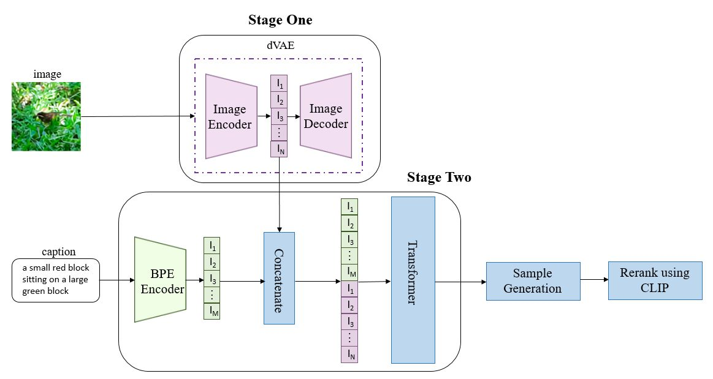
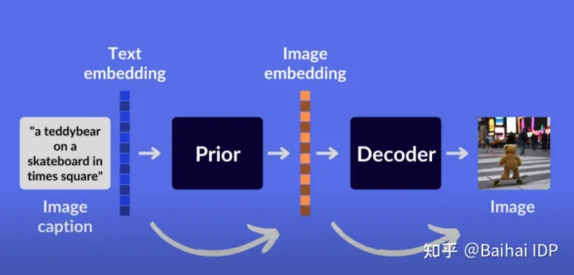

+++
author = "Yubao"
title = "DALL-E"
date = "2024-08-31"
description = "DALL-E"
tags = [
    "DALL-E",
]
categories = [
    "AI",
]
draft = false
image = "https://images.ctfassets.net/kftzwdyauwt9/ed21faee-ce44-4d91-f5cc39941d47/bdd3983530857e93d205304e219e2d95/dall-e.jpg?w=1920&q=90&fm=webp"
+++

## 2021 DALL-E

[1] A. Ramesh *et al.*,  Zero-Shot Text-to-Image Generation,  Feb. 26, 2021, *arXiv*: arXiv:2102.12092.

- https://openai.com/index/dall-e/
- https://github.com/openai/DALL-E
- https://www.dall-efree.com/

- VQGAN, VAE
- codebook 定义好所有已知的特征

