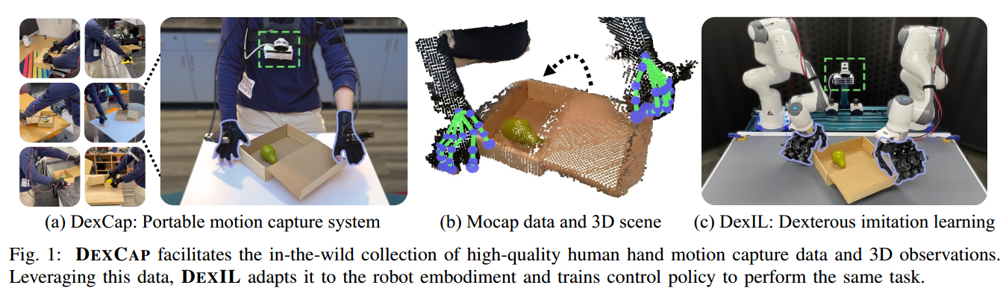
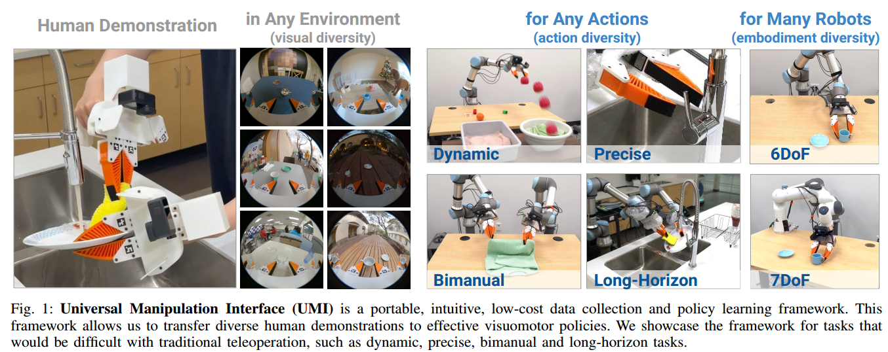

+++
author = "Yubao"
title = "Dataset"
date = "2024-05-06"
description = "Dataset"
image = "img/cover.jpg"
tags = [
"Dataset",
]
archives = ["2024/05"]
draft = false
+++

# 网上找到的国内下载地址

Refer: https://blog.csdn.net/qq_36170626/article/details/94902166

- TUM

链接：https://pan.baidu.com/s/1nwXtGqH 密码：lsgr

- KITTI

链接：https://pan.baidu.com/s/1htFmXDE 密码：uu20

- KITTI gt

链接:https://pan.baidu.com/s/1lX6VEhl2pPpU_3Wcp3VYdg 提取码:5ux2

- DSO

链接：https://pan.baidu.com/s/1eSRmeZK 密码：6x5b

- Mono

链接：https://pan.baidu.com/s/1jKaNB3C 密码：u57r

- EuRoC

链接：https://pan.baidu.com/s/1miXf40o 密码：xm59

KITTI raw data:https://pan.baidu.com/s/1TyXbifoTHubu3zt4jZ90Wg 提取码: n9ys


# EuRoC

[EuRoC_download](https://projects.asl.ethz.ch/datasets/doku.php?id=kmavvisualinertialdatasets)

```sh
# Machine Hall
http://robotics.ethz.ch/~asl-datasets/ijrr_euroc_mav_dataset/machine_hall/MH_01_easy/MH_01_easy.zip
http://robotics.ethz.ch/~asl-datasets/ijrr_euroc_mav_dataset/machine_hall/MH_02_easy/MH_02_easy.zip
http://robotics.ethz.ch/~asl-datasets/ijrr_euroc_mav_dataset/machine_hall/MH_03_medium/MH_03_medium.zip
http://robotics.ethz.ch/~asl-datasets/ijrr_euroc_mav_dataset/machine_hall/MH_04_difficult/MH_04_difficult.zip
http://robotics.ethz.ch/~asl-datasets/ijrr_euroc_mav_dataset/machine_hall/MH_05_difficult/MH_05_difficult.zip

http://robotics.ethz.ch/~asl-datasets/ijrr_euroc_mav_dataset/machine_hall/MH_01_easy/MH_01_easy.bag
http://robotics.ethz.ch/~asl-datasets/ijrr_euroc_mav_dataset/machine_hall/MH_02_easy/MH_02_easy.bag
http://robotics.ethz.ch/~asl-datasets/ijrr_euroc_mav_dataset/machine_hall/MH_03_medium/MH_03_medium.bag
http://robotics.ethz.ch/~asl-datasets/ijrr_euroc_mav_dataset/machine_hall/MH_04_difficult/MH_04_difficult.bag
http://robotics.ethz.ch/~asl-datasets/ijrr_euroc_mav_dataset/machine_hall/MH_05_difficult/MH_05_difficult.bag

# Vicon Room 1
http://robotics.ethz.ch/~asl-datasets/ijrr_euroc_mav_dataset/vicon_room1/V1_01_easy/V1_01_easy.zip
http://robotics.ethz.ch/~asl-datasets/ijrr_euroc_mav_dataset/vicon_room1/V1_02_medium/V1_02_medium.zip
http://robotics.ethz.ch/~asl-datasets/ijrr_euroc_mav_dataset/vicon_room1/V1_03_difficult/V1_03_difficult.zip

# Vicon Room 2
http://robotics.ethz.ch/~asl-datasets/ijrr_euroc_mav_dataset/vicon_room2/V2_01_easy/V2_01_easy.zip
http://robotics.ethz.ch/~asl-datasets/ijrr_euroc_mav_dataset/vicon_room2/V2_02_medium/V2_02_medium.zip
http://robotics.ethz.ch/~asl-datasets/ijrr_euroc_mav_dataset/vicon_room2/V2_03_difficult/V2_03_difficult.zip

# Calibration Dataset
http://robotics.ethz.ch/~asl-datasets/ijrr_euroc_mav_dataset/calibration_datasets/
```

# Loop closure
- New College and City Centre https://www.robots.ox.ac.uk/~mobile/IJRR_2008_Dataset/data.html


# Papers

## DexCap

[1] C. Wang, H. Shi, W. Wang, R. Zhang, L. Fei-Fei, and C. K. Liu,  DexCap: Scalable and Portable Mocap Data Collection System for Dexterous Manipulation,  Jul. 04, 2024, *arXiv*: arXiv:2403.07788. 




## Universal Manipulation Interface

[1] C. Chi *et al.*,  Universal Manipulation Interface: In-The-Wild Robot Teaching Without In-The-Wild Robots,  Mar. 05, 2024, *arXiv*: arXiv:2402.10329. 




## **HIRO Hand**

- https://sites.google.com/view/hiro-hand/%E9%A6%96%E9%A1%B5


# Others

- Omni6DPose
- FAB-MAP: https://www.robots.ox.ac.uk/~mobile/IJRR_2008_Dataset/
