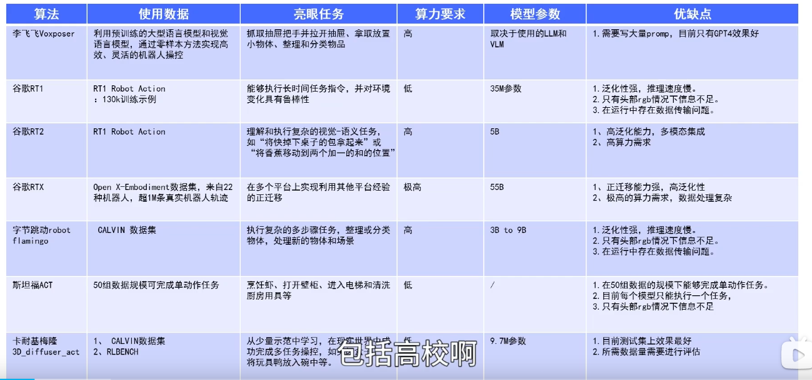
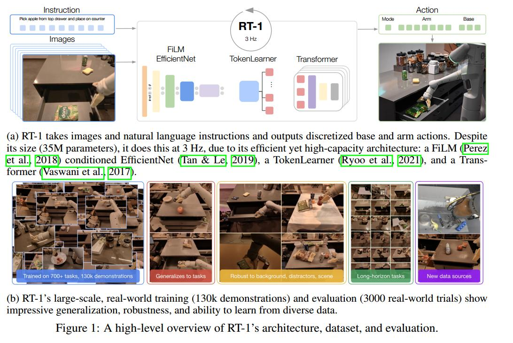
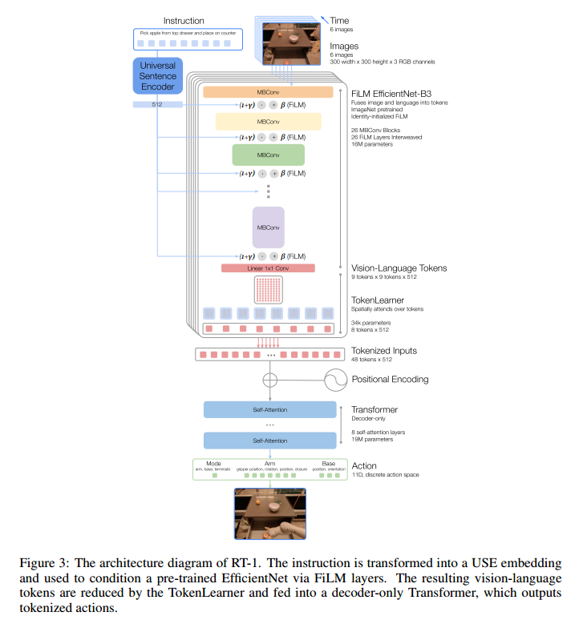
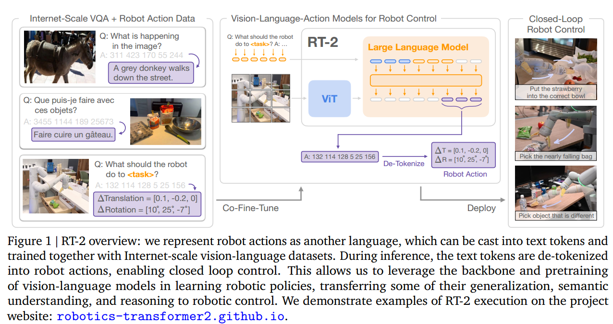
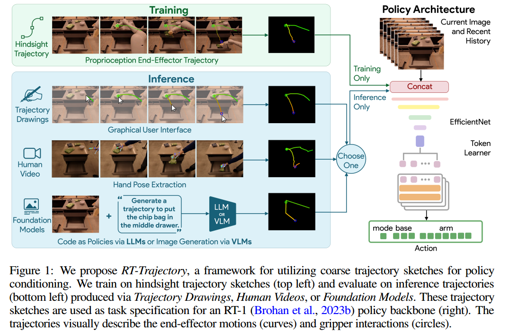
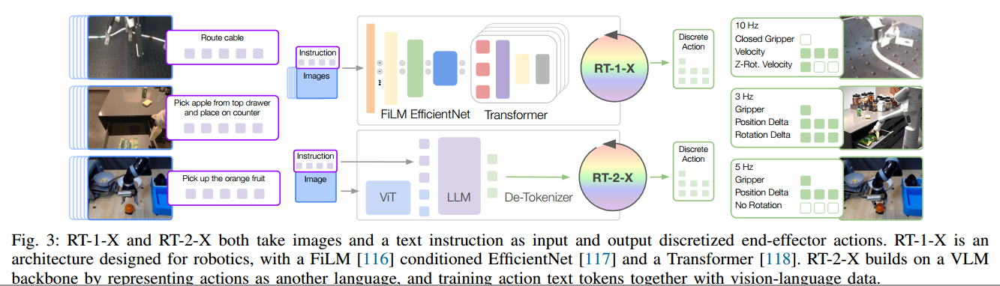
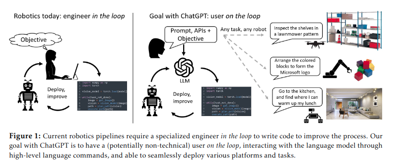
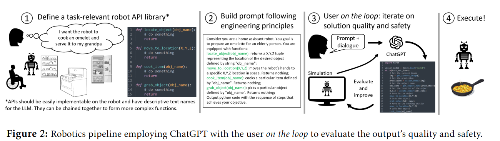

+++
author = "Yubao"
title = "LLM for Robotics"
date = "2025-08-31"
description = "LLM for Robotics"
tags = [
    "LLM",
    "具身智能",
    "Robotics",
]
categories = [
    "Robotics",
]
image = "https://pica.zhimg.com/v2-65c3cde1b1c5ad687e7f3286e294a7cf_720w.jpg"
+++

# Introduction

# LLM for Robotics

## RT-1

[1] A. Brohan *et al.*,  RT-1: Robotics Transformer for Real-World Control at Scale,  Aug. 11, 2023, *arXiv*: arXiv:2212.06817. [Online]. Available: http://arxiv.org/abs/2212.06817

The keys to the success of such models lie with open-ended task-agnostic training, combined with high-capacity architectures that can absorb all of the knowledge present in large-scale datasets. 
Can we train a single, capable, large multi-task backbone model on data consisting of a wide variety of robotic tasks?

The goal of this work is to build and demonstrate a general robot learning system that can absorb large amounts of data and generalize effectively.

The actions consist of seven dimensions for the arm movement (x, y, z, roll, pitch, yaw, opening of the gripper), three dimensions for base movement (x, y, yaw) and a discrete dimension to switch between three modes: controlling the arm, the base, or terminating the episode.

当前大型多任务机器人policies存在的问题：

- have limited breadth of real-world tasks
- focus on training tasks rather than generalization to new task
- attain comparatively lower performance on new tasks

**TokenLearner**

TokenLearner将从预训练的film - effentnet层中产生的81个视觉标记子采样到仅8个最终标记，然后传递到我们的Transformer层

**局限**

- 它是一种模仿学习方法，它继承了这类方法的局限，例如它可能无法超越演示者的表现
- 对新指令的泛化仅限于以前见过的概念的组合，不能泛化到以前从未见过的全新运动
- 方法使用在一个大但**不是很灵巧**的操作任务集中，计划扩展指令集解决

## RT-2

[1] A. Brohan *et al.*,  RT-2: Vision-Language-Action Models Transfer Web Knowledge to Robotic Control,  Jul. 28, 2023, *arXiv*: arXiv:2307.15818. [Online]. Available: http://arxiv.org/abs/2307.15818

We study how vision-language models trained on Internet-scale data can be incorporated directly into
end-to-end robotic control to boost generalization and enable emergent semantic reasoning. Our goal is
to enable a single end-to-end trained model to both learn to map robot observations to actions and enjoy
the benefits of large-scale pretraining on language and vision-language data from the web. To this end,
we propose to co-fine-tune state-of-the-art vision-language models on both robotic trajectory data and
Internet-scale vision-language tasks, such as visual question answering. In contrast to other approaches,
we propose a simple, general recipe to achieve this goal: in order to fit both natural language responses
and robotic actions into the same format, we express the actions as text tokens and incorporate them
directly into the training set of the model in the same way as natural language tokens. We refer to
such category of models as vision-language-action models (VLA) and instantiate an example of such
a model, which we call RT-2. 

## 2023 RT-Trajectory

[1] J. Gu *et al.*,  RT-Trajectory: Robotic Task Generalization via Hindsight Trajectory Sketches,  Nov. 06, 2023, *arXiv*: arXiv:2311.01977. 

Generalization remains one of the most important desiderata for robust robot learning systems. While recently proposed approaches show promise in generalization to novel objects, semantic concepts, or visual distribution shifts, generalization to new tasks remains challenging. For example, a language-conditioned policy trained on pick-andplace tasks will not be able to generalize to a folding task, even if the arm trajectory of folding is similar to pick-and-place. Our key insight is that this kind of generalization becomes feasible if we represent the task through rough trajectory sketches. 

We propose a policy conditioning method using such rough trajectory sketches, which we call RTTrajectory, that is practical, easy to specify, and allows the policy to effectively perform new tasks that would otherwise be challenging to perform.

## 2024 Open X-Embodiment

[1] O. X.-E. Collaboration *et al.*,  Open X-Embodiment: Robotic Learning Datasets and RT-X Models,  Jun. 01, 2024, *arXiv*: arXiv:2310.08864. 

 we have two goals: 

(1) Evaluate whether policies trained on data from many different robots and environments enjoy the benefits of positive transfer, attaining better performance than policies trained only on data from each evaluation setup. 

(2) Organize large robotic datasets to enable future research on X-embodiment models

We focus our work on robotic manipulation. 

Addressing goal (1), our empirical contribution is to demonstrate that several recent robotic learning methods, with minimal modification, can utilize X-embodiment data and enable positive transfer. Specifically, we train the RT-1 [8] and RT-2 [9] models on 9 different robotic manipulators. We show that the resulting models, which we call RT-X, can improve over policies trained only on data from the evaluation domain, exhibiting better generalization and new capabilities. 

Addressing (2), we provide the Open X-Embodiment (OXE) Repository, which includes a dataset with 22 different robotic embodiments from 21 different institutions that can enable the robotics community to pursue further research on Xembodiment models, along with open-source tools to facilitate such research. 

Our aim is not to innovate in terms of the particular architectures and algorithms, but rather to provide the model that we trained together with data and tools to energize research around X-embodiment robotic learning.

## 2023 ChatGPT for Robotics

- https://github.com/microsoft/PromptCraft-Robotics

# References:

- [RT-1 论文翻译](https://blog.csdn.net/l963852k/article/details/133717731)
- [csdn-RT-1 论文阅读](https://geek.csdn.net/65e57d5f9a0b6f536f0c05f3.html#devmenu1)
