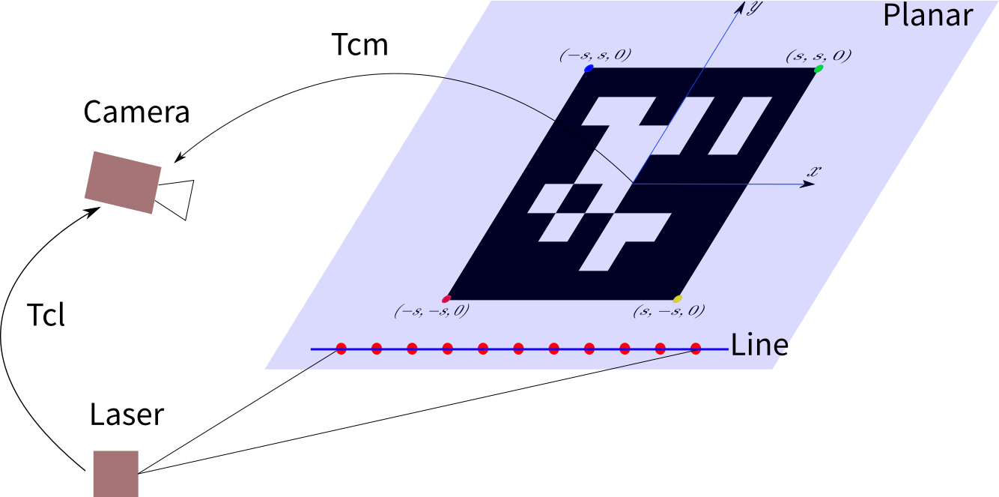
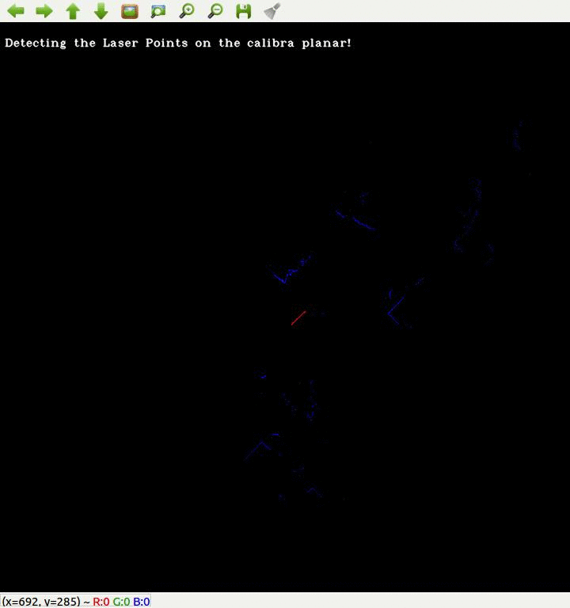

+++
author = "Yubao"
title = "Lidar Cam Calibration"
date = "2025-07-10"
description = "Lang Chain"
tags = [
    "SLAM",
]
categories = [
    "SLAM",
]
image = "https://github.com/Deephome/Awesome-LiDAR-Camera-Calibration/raw/main/projection.png"
+++


# Introduction



# Prepare Camera and Lidar

- Start Lidar

```shell
roslaunch pepperl_fuchs_r2000 r2000.launch scanner_ip:=192.168.3.1
```

topic name: /r2000_node/scan

- Start USB camera

```shell
roslaunch usb_cam usb_cam-test.launch
```

or

```shell
roslaunch usb_cam.launch dev:=/dev/video4
```

usb_cam.launch:

```shell
<launch>
    <arg name="dev" default="/dev/video0" />
  <node name="usb_cam" pkg="usb_cam" type="usb_cam_node" output="screen">
    <param name="video_device" value="$(arg dev)" />
    <param name="image_width" value="640" />
    <param name="image_height" value="480" />
    <param name="pixel_format" value="yuyv" />
    <param name="camera_frame_id" value="usb_cam" />
    <param name="io_method" value="mmap"/>
  </node>
</launch>
```

topic name: /usb_cam/image_raw

- Record bag

```shell
rosbag record -o calib.bag /usb_cam/image_raw /r2000_node/scan
```

# Start Calibration

- Get ROS package and compile: https://gitcode.com/gh_mirrors/ca/CamLaserCalibraTool.git

## 识别二维码

- 配置好 config/calibra_config_pinhole.yaml 文件

```yaml
%YAML:1.0

#common parameters
savePath: "/home/ubuntu/share/log/"
bag_path: "/home/ubuntu/share/calib_2025-03-13-23-48-18.bag"

scan_topic_name: "/r2000_node/scan"
img_topic_name: "/usb_cam/image_raw"

# tag info
tag_type: 1 # 1: kalibr_tag, 2: apriltag
tag_size: 0.088 # tag size, unit meter
tag_spacing: 0.026 # tag spacing, only used in kalibr_tag. For details, please see kalibr tag description.
black_border: 2 # if you use kalibr_tag black_boarder = 2; if you use apriltag black_boarder = 1

#camera calibration
model_type: PINHOLE
camera_name: camera
image_width: 640
image_height: 480

distortion_parameters:
    k1: 3.5877511162985959e-02
    k2: -2.4550111196225166e-01
    p1: -7.4648231588951963e-03
    p2: -3.0517325747459593e-03

projection_parameters:
    fx: 6.4474097189507791e+02
    fy: 6.4541923462092529e+02
    cx: 2.8987973673598606e+02
    cy: 2.3953228288289316e+02
```

- run

```shell
roslaunch lasercamcal_ros kalibra_apriltag.launch  config_path:=/home/ubuntu/catkin_ws/src/CamLaserCalibraTool/config/calibra_config_pinhole.yaml
```


会生成　apriltag_pose.txt

## 运行激光视觉外参数标定代码

```shell
 roslaunch lasercamcal_ros calibra_offline.launch config_path:=/home/ubuntu/catkin_ws/src/CamLaserCalibraTool/config/calibra_config_pinhole.yaml
```



- Results

会生成　result.yaml

```sh
%YAML:1.0
---
extrinsicTlc: !!opencv-matrix
   rows: 4
   cols: 4
   dt: d
   data: [ 1.0732971597071227e-01, -3.0248586809222477e-01,
       9.4709167015349616e-01, 1.9541517574511444e-01,
       -9.8887645964585968e-01, -1.3114127080227950e-01,
       7.0180585995224740e-02, -2.2962703435676465e-01,
       1.0297416971219635e-01, -9.4408912010299950e-01,
       -3.1319650967919049e-01, 2.1529888609154316e-01, 0., 0., 0., 1. ]
RollPitchYaw: !!opencv-matrix
   rows: 3
   cols: 1
   dt: d
   data: [ -1.8911163805778963e+00, -1.0315702778309432e-01,
       -1.4626825065784594e+00 ]
txtytz: !!opencv-matrix
   rows: 3
   cols: 1
   dt: d
   data: [ 1.9541517574511444e-01, -2.2962703435676465e-01,
       2.1529888609154316e-01 ]
```


