+++
author = "Yubao"
title = "RAG"
date = "2025-07-09"
description = "RAG (Retrieval Augmented Generation)"
tags = [
    "rag",
]
categories = [
    "rag",
]
series = ["series_rag"]
aliases = ["aliases_rag"]
image = "https://encrypted-tbn0.gstatic.com/images?q=tbn:ANd9GcR08xYRpN-yo-MgTEYR_j-6-aZP1pC6dy4cww&s"
+++

# Introduction

RAG (Retrieval Augmented Generation)

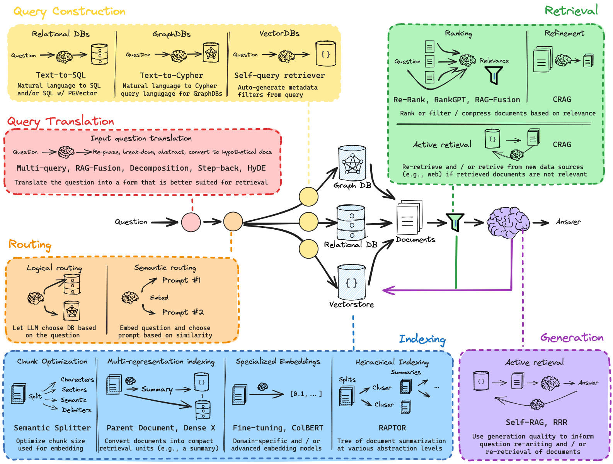

## LLM固有的局限性

- LLM的知识不是实时的
- LLM可能不知道你私有的领域、业务知识

## 使用LangChain编译RAG

- [Build a Retrieval Augmented Generation (RAG) App](https://python.langchain.com/v0.2/docs/tutorials/rag/)


# RAG Papers

## Retrieval-Augmented Generation for Knowledge-Intensive NLP Tasks

[1] P. Lewis *et al.*,  Retrieval-Augmented Generation for Knowledge-Intensive NLP Tasks,  Apr. 12, 2021, *arXiv*: arXiv:2005.11401. 

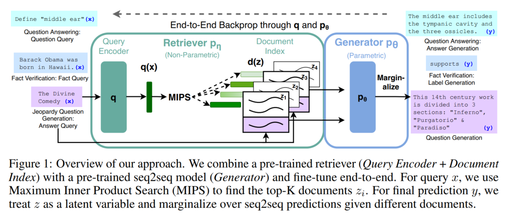

- 这是最初RAG的模型

- 端到端训练：将检索到的文档视为隐变量

**Methods**:

- user prompt: $x$
- the target sequence: $y$
- database index: $z$ , 比如从wiki获得的内容的索引向量， 知识文本
- retriever $p_\eta(z|x)$ ， Retriever的目的是根据输入$x$来寻找最适合的z ，（z是从数据库中查询到的？）
- generator: $p_\theta (y_i| x, z, y_{1:i-1})$ , 生成器是一个自回归的语言模型，（z指的是查询到的文章？）

在生成器中，我们想要的是$p_\theta (y_i| x, y_{1:i-1})$ ，把$z$从公式中去掉。本文提出了两种方案：

- RAG-Sequence Model

  生成模型的计算公式

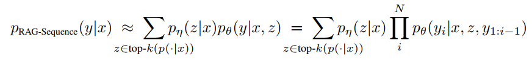

使用全概率公式进行边缘化处理，把z消掉，得到一个y关于x的概率。在生成语句的时候，才把z去掉，即在生成整个sequence的时候才会决定哪些z会对我们的生成有重要的影响。这里使用的是前k个进行近似。

假设给定100个文档，模型根据每个文档都生成一句话，那麽总共会生成100句话。把它们整合起来生成最终的结果。

- RAG-Token Model

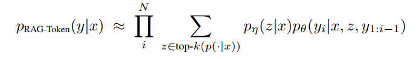

在生成每个tocken的时候，每个token都会被不同的z所影响。

在生成每个字的时候，都去参考这100个文档，看看哪篇文章的相关度大，让对应的文章影响最终的生成。

**Retriever: DPR**

- Bert based query encoder: $q(x)$
- Bert based document enoder: $d(z)$

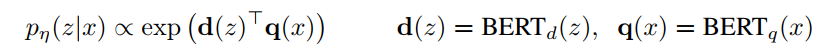

**Generator: BART**

BART-large: 400M parameters

**Performance**:

此图所示的是后验概率

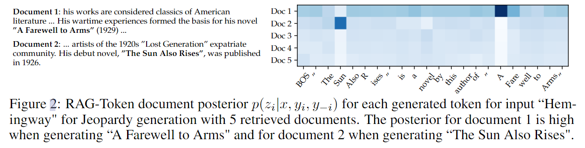

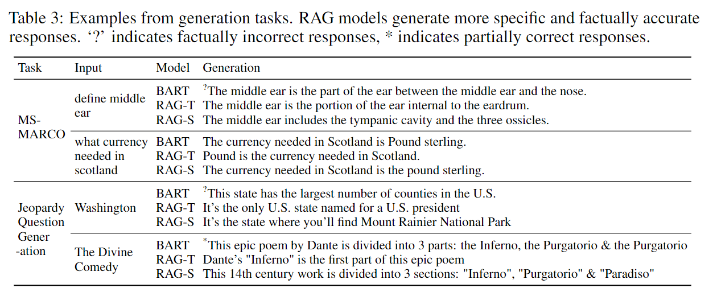

## Self-RAG

[1] A. Asai, Z. Wu, Y. Wang, A. Sil, and H. Hajishirzi,  Self-RAG: Learning to Retrieve, Generate, and Critique through Self-Reflection,  Oct. 17, 2023, *arXiv*: arXiv:2310.11511. https://selfrag.github.io/

前文所述的 RAG 方法都遵循着共同的范式，即query+context→LLM

其中 query 表示用户的输入，context 表示检索获得的补充信息，然后共同输入到 LLM 中，可以认为这是一种检索前置的被动的增强方式。

相比而言，Self-RAG 则是更加主动和智能的实现方式，主要步骤概括如下：

1. 判断是否需要额外检索事实性信息（retrieve on demand），仅当有需要时才召回
2. 平行处理每个片段：生产prompt+一个片段的生成结果
3. 使用反思字段，检查输出是否相关，选择最符合需要的片段；
4. 再重复检索
5. 生成结果会引用相关片段，以及输出结果是否符合该片段，便于查证事实。

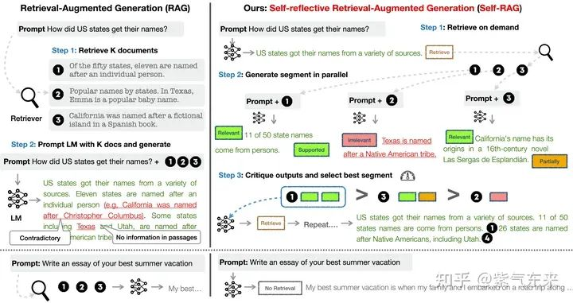


Self-RAG 的一个重要创新是 Reflection tokens (反思字符)：通过生成反思字符这一特殊标记来检查输出。这些字符会分为 Retrieve 和 Critique 两种类型，会标示：检查是否有检索的必要，完成检索后检查输出的相关性、完整性、检索片段是否支持输出的观点。模型会基于原有词库和反思字段来生成下一个 token。

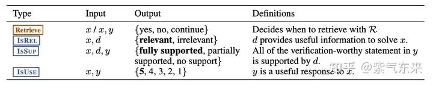


## HyKGE

X. Jiang *et al.*,  HyKGE: A Hypothesis Knowledge Graph Enhanced Framework for Accurate and Reliable Medical LLMs Responses,  Apr. 19, 2024, *arXiv*: arXiv:2312.15883. 

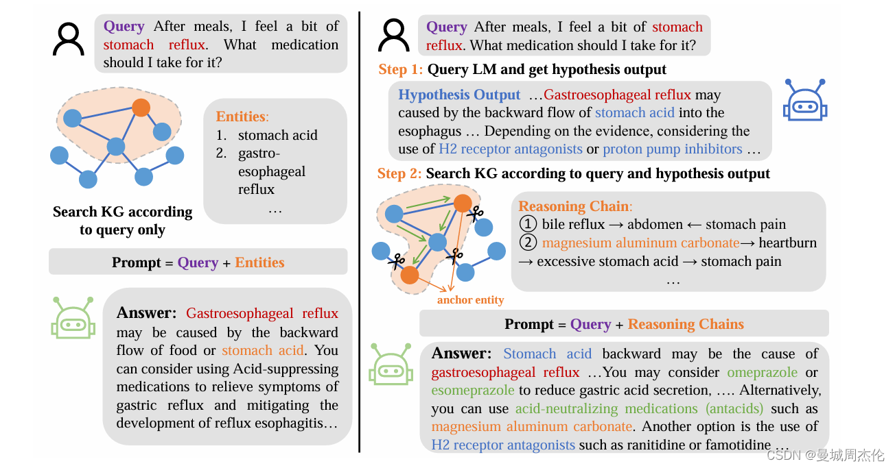


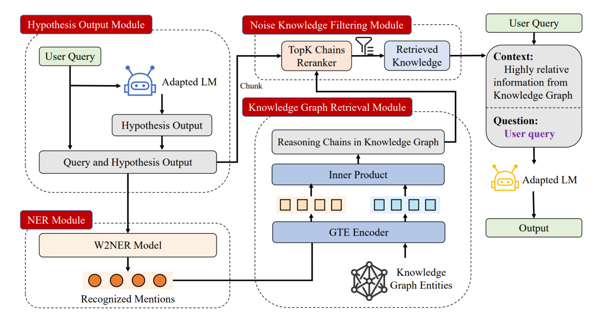


## Triplex — SOTA LLM for Knowledge Graph Construction

- https://www.sciphi.ai/blog/triplex
- [Triplex vs. GPT-4：将Graph RAG成本降低98%的革命性模型、知识图谱构建的 SOTA LLM](https://blog.csdn.net/m0_59164304/article/details/141473467)

知识图谱（例如 Microsoft 的**Graph RAG**）增强了 RAG 方法，但构建成本高昂。Triplex 可将知识图谱创建成本降低 98%，性能优于 GPT-4，成本仅为 GPT-4 的 1/60。

并且可以使用 SciPhi 的 R2R 框架快捷构建本地图谱。

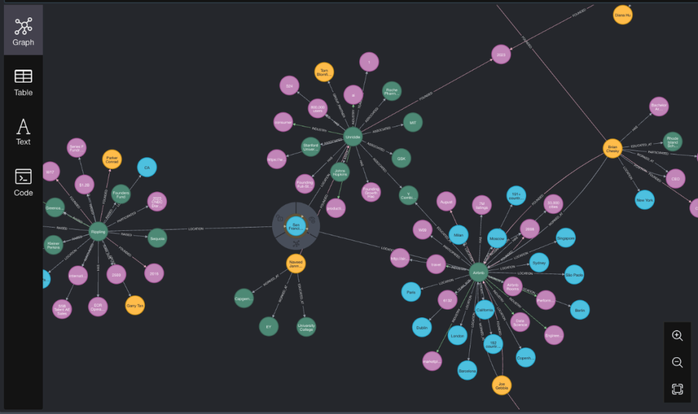

Triplex 是 SciPhi.AI 开发的 Phi3-3.8B 的微调版本，用于从非结构化数据创建知识图谱。它的工作原理是从文本或其他数据源中提取三元组（由主语、谓语和宾语组成的简单语句）。

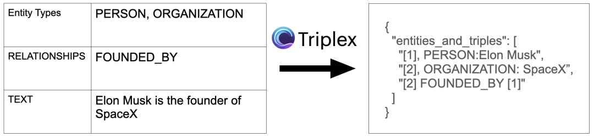

GraphRAG 与 Triplex
知识图谱擅长回答传统搜索方法通常难以回答的查询，尤其是人口级关系查询。例如，“提供一份就读技术学校的 AI 员工名单”。微软发布 GraphRAG 后，人们对知识图谱的兴趣愈演愈烈。

但是，知识图谱构建过程传统上非常复杂且资源密集，限制了其广泛应用。最近的估计表明，微软的 GraphRAG 程序成本特别高，要求为每个输入标记生成至少一个输出标记。这种高成本使其对于大多数应用程序来说不切实际。

Triplex 的目标是通过将知识图谱的生成成本降低十倍来彻底颠覆这一模式。这一成本降低是通过 Triplex 将非结构化文本转换为“语义三元组”——知识图谱的构建块——的有效方法实现的。

为了演示 Triplex 如何创建这些图谱，观察一下它如何处理简单的句子：
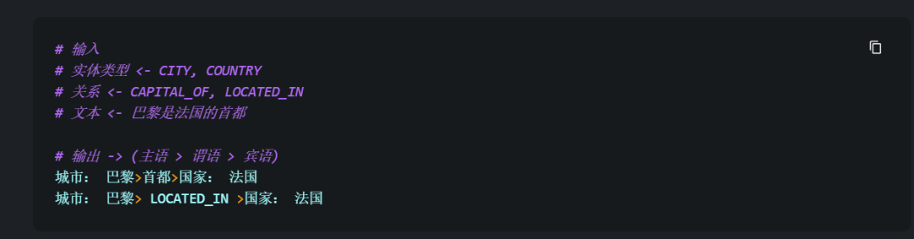


## A Comprehensive Survey on Automatic Knowledge Graph Construction


## Retrieval-Augmented Generation for Large Language Models: A Survey

[1] Y. Gao *et al.*,  Retrieval-Augmented Generation for Large Language Models: A Survey,  Mar. 27, 2024, *arXiv*: arXiv:2312.10997. 

# References

- https://github.com/Creator-SN/IKFB.git
- https://github.com/Creator-SN/Fabulous

Involution King Fun Book (IKFB, Chinese: 快卷, 卷王快乐本) is an integrated management system for papers and literature. 

- [Multimodal Retrieval Augmented Generation(RAG)](https://weaviate.io/blog/multimodal-rag)
- https://sbert.net/
- https://github.com/FlagOpen
- [bilibil-什么是RAG，数据向量化，向量搜索](https://www.bilibili.com/video/BV1ZRvHeMEK4/?p=12&spm_id_from=pageDriver)

- https://github.com/Tongji-KGLLM/RAG-Survey/blob/main/assets/RAG_Slide_ENG.pdf
- https://github.com/sugarforever/LangChain-Tutorials
- https://github.com/sugarforever/LangChain-Advanced
- https://github.com/sugarforever/Advanced-RAG
- [bilibili- Advanced RAG 01 半结构化数据上的RAG](https://www.bilibili.com/video/BV1tN4y1m78N/?spm_id_from=333.788&vd_source=f6aa186edd20e449545aecf6d36f2e08)
- [GraphRAG与普通RAG比较，效果，速度，费用](https://www.bilibili.com/video/BV1Ym421G71g/?spm_id_from=333.337.search-card.all.click&vd_source=f6aa186edd20e449545aecf6d36f2e08)
- bilibil - [RAG和Self-RAG简介](https://www.bilibili.com/video/BV1YC4y1U7u5/?spm_id_from=333.337.search-card.all.click&vd_source=f6aa186edd20e449545aecf6d36f2e08): https://nobleai.notion.site/LLM-RAG-acca19ee9a884fbc952e712dccd61832?pvs=4
- [从 RAG 到 Self-RAG —— LLM 的知识增强](https://blog.csdn.net/weixin_40920183/article/details/134389736)

[1] P. Lewis *et al.*,  Retrieval-Augmented Generation for Knowledge-Intensive NLP Tasks,  Apr. 12, 2021, *arXiv*: arXiv:2005.11401. Accessed: Aug. 28, 2024. [Online]. Available: http://arxiv.org/abs/2005.11401

[1] D. Edge *et al.*,  From Local to Global: A Graph RAG Approach to Query-Focused Summarization,  Apr. 24, 2024, *arXiv*: arXiv:2404.16130. Accessed: Aug. 19, 2024. [Online]. Available: http://arxiv.org/abs/2404.16130

[1] A. Asai, Z. Wu, Y. Wang, A. Sil, and H. Hajishirzi,  Self-RAG: Learning to Retrieve, Generate, and Critique through Self-Reflection,  Oct. 17, 2023, *arXiv*: arXiv:2310.11511. Accessed: Aug. 28, 2024. 

[1] X. Jiang *et al.*,  HyKGE: A Hypothesis Knowledge Graph Enhanced Framework for Accurate and Reliable Medical LLMs Responses,  Apr. 19, 2024, *arXiv*: arXiv:2312.15883. 

# Issues

- USER_AGENT environment variable not set, consider setting it to identify your requests.

```sh
import os
os.environ['USER_AGENT'] = 'Mozilla/5.0 (X11; Linux x86_64) AppleWebKit/537.36 (KHTML, like Gecko) Chrome/121.0.0.0 Safari/537.36'
```

For chrome: ``chrome://version/``