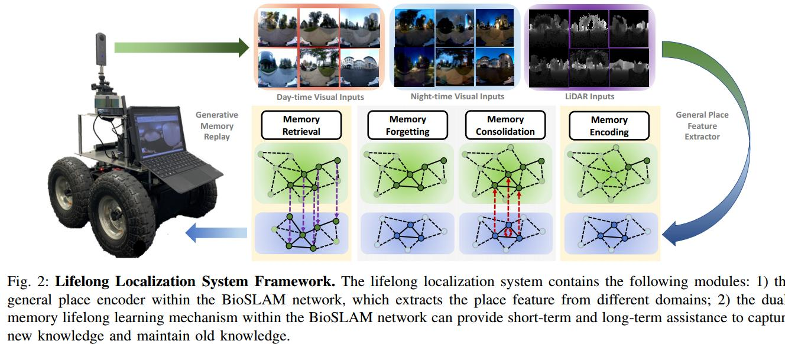
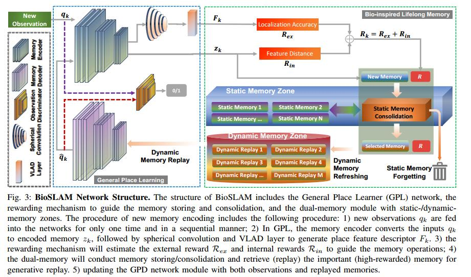

+++
author = "Yubao"
title = "SLAM2"
date = "2024-08-31"
description = "SLAM2"
tags = [
    "slam",
]
categories = [
    "slam",
]
series = ["series_slam"]
aliases = ["aliases_slam"]
image = "image-20240830140756202.png"
+++

# Introduction

- [MetaSLAM](https://github.com/MetaSLAM)

# Papers

## BioSLAM

[1] P. Yin, A. Abuduweili, S. Zhao, C. Liu, and S. Scherer,  BioSLAM: A Bio-inspired Lifelong Memory System for General Place Recognition,  Aug. 30, 2022, *arXiv*: arXiv:2208.14543. 

- https://metaslam.github.io/

<iframe src="//player.bilibili.com/player.html?isOutside=true&aid=260849631&bvid=BV1pe411K7fw&cid=838815839&p=1&autoplay=0 scrolling="no" border="0" frameborder="no" framespacing="0" allowfullscreen="true" height="480" ></iframe>
