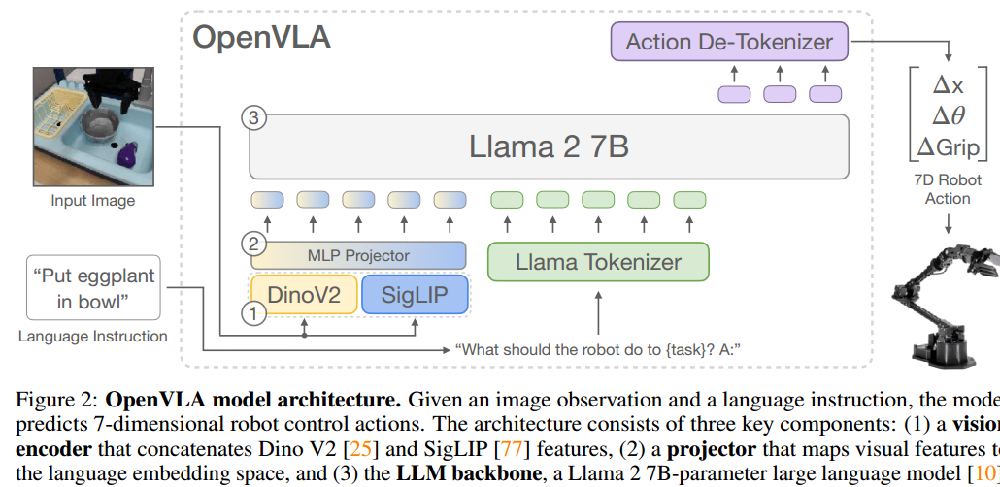

+++
author = "Yubao"
title = "VLA"
date = "2025-07-1"
description = "VLA"
tags = [
    "VLA",
]
categories = [
    "VLA",
]
image = "https://ai.access-company.com/wp-content/uploads/2025/04/Vision-Language-Action.png"
+++

# Introduction

Vision language to action tasks.

LLM for Robotics

## 2020 Transporter Networks: Rearranging the Visual World for Robotic Manipulation

[1] A. Zeng *et al.*,  Transporter Networks: Rearranging the Visual World for Robotic Manipulation,  Oct. 2020.

- https://transporternets.github.io

开山之作，是第一篇，直接通过视觉输入，输出"Spatial displacements"的文章。 

Robotic manipulation can be formulated as inducing a sequence of spatial displacements

we propose the Transporter Network, a simple model architecture that rearranges deep features to infer **spatial displacements** from **visual input** – which can parameterize robot actions.

The goal of Transporter Networks is to recover these distributions from visual observations alone – without
assumptions of objectness. 

We assume no prior information about the objects (e.g., no 3D models, poses, class categories, keypoints, etc.).

$fpick(g * o_t)=g * fpick(ot)$, where g is a translation, 先做与后做变换，效果相同

## 2023 Learning to Rearrange Deformable Cables, Fabrics, and Bags with Goal-Conditioned Transporter Networks

[1] D. Seita *et al.*,  Learning to Rearrange Deformable Cables, Fabrics, and Bags with Goal-Conditioned Transporter Networks,  Jun. 18, 2023, *arXiv*: arXiv:2012.03385. 

这一篇是“ Transporter Networks”的扩展，可以处理Deformable物体。

Strength:

- Formulating tabletop manipulation as a series of pick-and-place affordance preditctions
- Action-centric approach: the objective is to detect actions rather than detect objects and then learn a policy

## 2021 CLIPORT

- cliport.github.io

How can we imbue robots with the ability to manipulate objects precisely but also to reason about them in terms of abstract concepts? 

Recent works in manipulation have shown that end-to-end networks can learn dexterous skills that require precise spatial reasoning, but these methods often **fail to generalize to new goal**s or quickly learn transferable concepts across tasks. 

we propose a framework that combines the best of both worlds: a two-stream architecture with **semantic** and **spatial** pathways for vision-based manipulation.

Specifically, we present CLIPORT, a language-conditioned imitation learning agent that combines the broad semantic understanding (what) of CLIP [1] with the spatial precision (where) of Transporter.

our contributions are as follows:
• An extended benchmark of language-grounding tasks for manipulation in Ravens [2].
• Two-stream architecture for using internet pre-trained vision-language models for conditioning precise manipulation policies with language goals.
• Empirical results on a broad range of manipulation tasks, including multi-task models, validated with real-robot experiments.

## 2022 A Generalist Agent, Gato

Inspired by progress in large-scale language modeling, we apply a similar approach towards building a single generalist agent beyond the realm of text outputs. 

The agent, which we refer to as Gato, works as a multi-modal, multi-task, multi-embodiment generalist policy.

## 2022 BC-Z

引入了模仿学习，模仿人的视频动作

## 2022 Q-attention

[1] S. James and A. J. Davison,  Q-attention: Enabling Efficient Learning for Vision-based Robotic Manipulation,  Feb. 03, 2022, *arXiv*: arXiv:2105.14829. 

引入强化学习

## 2022 Coarse-to-Fine Q-attention

使用强化学习，是Q-attention文章的扩展

## 2022 PERCEIVER-ACTOR: A Multi-Task Transformer for Robotic Manipulation

In summary, our contributions are as follows:
• A novel problem formulation for perceiving, acting, and specifying goals with Transformers.
• An efficient action-centric framework for grounding language in 6-DoF actions.
• Empirical results investigating multi-task agents on a range of simulated and real-world task

## 2022 Do As I Can, Not As I Say: Grounding Language in Robotic Affordances
是第一篇引入LLM的文章，LLM缺少对当前环境的感知，不能直接利用LLM来做决策。

Large language models can encode a wealth of semantic knowledge about the world. Such knowledge could be extremely useful to robots aiming to act upon high-level, temporally extended instructions expressed in natural language.
However, a significant weakness of language models is that they **lack real-world experience**, which makes it difficult to leverage them for decision making within a given embodiment. 

While large language models can draw on a wealth of knowledge learned from copious amounts of text, they will not necessarily break down high-level commands into low-level instructions that are suitable for robotic execution. 

## 2023 VIMA

一个开源的仿真平台

https://vimalabs.github.io/

## 2024 VILA

## 3D VLA

## 2024 OpenVLA

[1] M. J. Kim *et al.*,  OpenVLA: An Open-Source Vision-Language-Action Model,  Jun. 13, 2024, *arXiv*: arXiv:2406.09246.   https://openvla.github.io/

The architecture of most recent VLMs [20, 42–44] consists of three main parts (see Fig. 2): 

(1) a visual encoder that maps image inputs to a number of “image patch embeddings”, 

(2) a projector that takes the output embeddings of the visual encoder and maps them into the input space of a language model, and 

(3) a large language model (LLM) backbone. 

During VLM training, the model is trained end-to-end with a next text token prediction objective on paired or interleaved vision and language data curated from various Internet sources.

# References

- https://github.com/openvla/openvla
