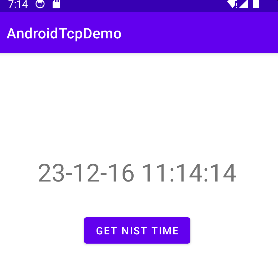
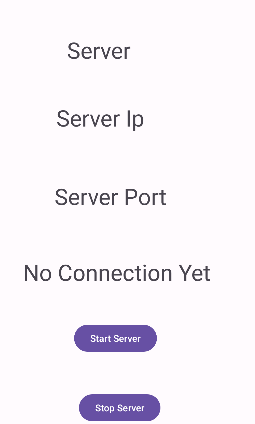

+++
title = "Android Socket"
description = "Android Socket"
date = "2023-12-16"
author = "Yubao"
image = "img/cover.jpg"
tags = [
"socket", "android"
]
archives = ["2023/12"]

+++

# A Simple TCP client of NIST time server

- Demo: AndroidTcpDemo-GetNISTTime

    

- Add Internet Permission to AndroidManifest.xml

    ```sh
    <uses-permission android:name="android.permission.INTERNET" />
    ```

-  Main Activity

    ```java
    
    // This is a simple Client app example to get NIST time
    package com.yubao.androidtcpdemo;
    
    import androidx.appcompat.app.AppCompatActivity;
    
    import android.os.Bundle;
    import android.view.View;
    import android.widget.TextView;
    
    import com.yubao.androidtcpdemo.databinding.ActivityMainBinding;
    
    import java.io.BufferedReader;
    import java.io.IOException;
    import java.io.InputStreamReader;
    import java.net.Socket;
    
    public class MainActivity extends AppCompatActivity {
    
    // Used to load the 'androidtcpdemo' library on application startup.
    static {
    System.loadLibrary("androidtcpdemo");
    }
    
    private ActivityMainBinding binding;
    
    private TextView tvTime;
    private String serverName = "time.nist.gov";
    private int serverPort = 13;
    
    @Override
    protected void onCreate(Bundle savedInstanceState) {
    super.onCreate(savedInstanceState);
    
    binding = ActivityMainBinding.inflate(getLayoutInflater());
    setContentView(binding.getRoot());
    
    // Example of a call to a native method
    //        TextView tv = binding.sampleText;
    //        tv.setText(stringFromJNI());
    }
    
    public void onClickGetTime(View view)
    {
    tvTime = findViewById(R.id.tvTime);
    NistTimeClient runable = new NistTimeClient(serverName, serverPort);
    new Thread(runable).start();
    }
    
    private class NistTimeClient implements Runnable{
    
    private String serverName;
    private int serverPort;
    
    public NistTimeClient(String serverName, int serverPort) {
    this.serverName = serverName;
    this.serverPort = serverPort;
    }
    
    @Override
    public void run() {
    try {
    Socket socket = new Socket(serverName, serverPort);
    BufferedReader br = new BufferedReader(new InputStreamReader((socket.getInputStream())));
    br.readLine();
    String recTime = br.readLine().substring(6, 23);
    socket.close();
    
    runOnUiThread(new Runnable() {
    @Override
    public void run() {
    tvTime.setText(recTime);
    }
    });
    } catch (IOException e) {
    throw new RuntimeException(e);
    }
    
    }
    }
    /**
     * A native method that is implemented by the 'androidtcpdemo' native library,
     * which is packaged with this application.
     */
     public native String stringFromJNI();
     }
    ```
- Design

    ```xml
    <TextView
    android:id="@+id/tvTime"
    android:layout_width="wrap_content"
    android:layout_height="wrap_content"
    android:text="System Time Here"
    android:textSize="34sp"
    app:layout_constraintBottom_toBottomOf="parent"
    app:layout_constraintEnd_toEndOf="parent"
    app:layout_constraintStart_toStartOf="parent"
    app:layout_constraintTop_toTopOf="parent"
    app:layout_constraintVertical_bias="0.215" />
    
    <Button
    android:id="@+id/btnGetTime"
    android:layout_width="wrap_content"
    android:layout_height="wrap_content"
    android:layout_marginTop="34dp"
    android:onClick="onClickGetTime"
    android:text="Get NIST Time"
    app:layout_constraintEnd_toEndOf="parent"
    app:layout_constraintHorizontal_bias="0.5"
    app:layout_constraintStart_toStartOf="parent"
    app:layout_constraintTop_toBottomOf="@+id/tvTime" />
    ```

# Client and Server Example

- Demo: AndroidTcpClientServer

    Client demo:
    

    

    Server demo:
    


- Add Permission

    ```xml
    <uses-permission android:name="android.permission.INTERNET" />
    <uses-permission android:name="android.permission.ACCESS_NETWORK_STATE" />
    <uses-permission android:name="android.permission.ACCESS_WIFI_STATE" />
    ```
- Client-end src

    ```cpp
    package com.yubao.androidtcpclient;
    import androidx.appcompat.app.AppCompatActivity;

    import android.os.Bundle;
    import android.view.View;
    import android.widget.Button;
    import android.widget.EditText;
    import android.widget.TextView;

    import com.yubao.androidtcpclient.databinding.ActivityMainBinding;

    import java.io.BufferedReader;
    import java.io.IOException;
    import java.io.InputStreamReader;
    import java.net.Socket;

    public class MainActivity extends AppCompatActivity {

    // Used to load the 'androidtcpclient' library on application startup.
    static {
    System.loadLibrary("androidtcpclient");
    }

    private ActivityMainBinding binding;

    // client example
    private  TextView tvReceivedData;
    private EditText etServerName, etServerPort;
    private Button btnClientConnect;
    private String serverName;
    private int serverPort;

    @Override
    protected void onCreate(Bundle savedInstanceState) {
    super.onCreate(savedInstanceState);

    binding = ActivityMainBinding.inflate(getLayoutInflater());
    setContentView(binding.getRoot());

    tvReceivedData = findViewById(R.id.tvReceivedData);
    etServerName = findViewById(R.id.etServerName);
    etServerPort = findViewById(R.id.etServerPort);
    btnClientConnect = findViewById(R.id.btnClientConnect);
    }

    public void onClictConnect(View view)
    {
    serverName = etServerName.getText().toString();
    serverPort = Integer.valueOf(etServerPort.getText().toString());

    new Thread(new Runnable() {
    @Override
    public void run() {
    try {
    Socket socket = new Socket(serverName, serverPort);

    BufferedReader br_input = new BufferedReader(new InputStreamReader(socket.getInputStream()));
    String txtFromServer = br_input.readLine();

    runOnUiThread(new Runnable() {
    @Override
    public void run() {
    tvReceivedData.setText(txtFromServer);
    }
    });
    } catch (IOException e) {
    throw new RuntimeException(e);
    }

    }
    }).start();
    }
    public native String stringFromJNI();
    }
    ```

- Server-end src

    ```csharp
    package com.yubao.androidtcpserver2;
    
    import androidx.appcompat.app.AppCompatActivity;
    
    import android.os.Bundle;
    import android.view.View;
    import android.widget.TextView;
    
    import java.io.IOException;
    import java.io.PrintStream;
    import java.io.PrintWriter;
    import java.net.ServerSocket;
    import java.net.Socket;
    
    public class ServerActivity extends AppCompatActivity {
    
    private TextView tvServerName, tvServerPort, tvStatus;
    private String serverIP = "127.0.0.1";
    private int serverPort = 8899;
    
    @Override
    protected void onCreate(Bundle savedInstanceState) {
    super.onCreate(savedInstanceState);
    setContentView(R.layout.activity_server);
    
    tvServerName = findViewById(R.id.tvServerName);
    tvServerPort = findViewById(R.id.tvServerPort);
    tvStatus = findViewById(R.id.tvStatus);
    
    tvServerName.setText(serverIP );
    tvServerPort.setText(String.valueOf(serverPort));
    }
    
    private ServerThread serverThread;
    public void onCLiickServer(View view)
    {
    serverThread = new ServerThread();
    serverThread.StartServer();
    }
    
    public void onClickStopServer(View view){
    serverThread.StopServer();
    }
    
    class ServerThread extends Thread implements Runnable{
    private boolean serverRunning;
    private ServerSocket serverSocket;
    private int count =0;
    
    public void StartServer()
    {
    serverRunning = true;
    start();
    }
    
    @Override
    public void run() {
    try {
    serverSocket = new ServerSocket(serverPort);
    runOnUiThread(new Runnable() {
    @Override
    public void run() {
    tvStatus.setText("Waiting for clients");
    
    }
    });
    while(serverRunning)
    {
    Socket socket = serverSocket.accept();
    count++;
    runOnUiThread(new Runnable() {
    @Override
    public void run() {
    tvStatus.setText("Connect to: " + socket.getInetAddress() + " : " +socket.getLocalPort());
    }
    });
    PrintWriter output_server = new PrintWriter(socket.getOutputStream());
    output_server.write("Welcome to Server:" + count);
    output_server.flush();
    socket.close();
    }
    } catch (IOException e) {
    throw new RuntimeException(e);
    }
    }
    public void StopServer(){
    serverRunning = false;
    new Thread(new Runnable() {
    @Override
    public void run() {
    if (serverSocket != null) {
    try {
    serverSocket.close();
    runOnUiThread(new Runnable() {
    @Override
    public void run() {
    tvStatus.setText("Server Stopped");
    }
    });
    } catch (IOException e) {
    throw new RuntimeException(e);
    }
    }
    }
    }).start();
    }
    }// class ServerThread
    
    }
    ```
