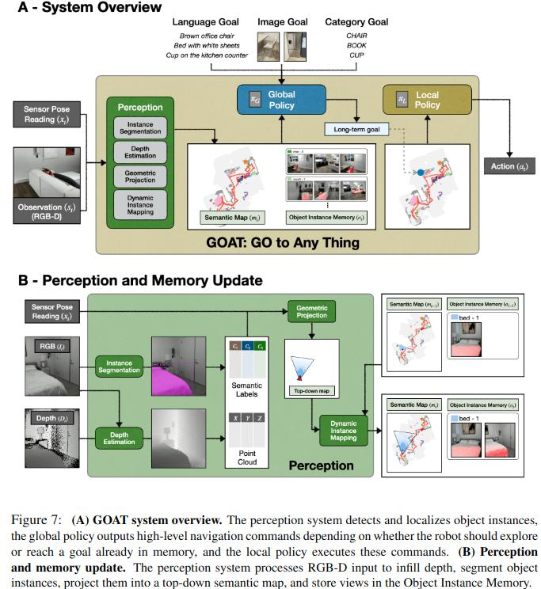

+++
author = "Yubao"
title = "具身智能"
date = "2024-08-31"
description = "具身智能"
tags = [
    "具身智能",
    "Robotics",
]
categories = [
    "Robotics",
]
series = ["series_robotics"]
aliases = ["aliases_robotics"]
image = "image-20240830110542547.png"
+++

# Introduction

场景理解，分割与检测：

- SAM
- Open-Voc Detection
- SAM3D
- Open-Voc Detection in Point Cloud

# Related papers

## GOAT: GO to Any Thing

是个Navigation任务

- 使用MaskRCNN实例分割进行目标检测和像素分割
- 使用MidDaS头单目深度估计进行RGBD传感器数据修复
- 分割衙的RGBD投影Semantic Map进行环境建图
- 使用SuperGlue进行图像匹配
- 使用CLIP进行文本与图像匹配
- 使用Mistral 7B从复杂指令抽提Object Category

## 2024 GOAT-Bench

- https://github.com/Ram81/goat-bench.git

- https://mukulkhanna.github.io/goat-bench/

## 2024 OK-Robot

[1] P. Liu, Y. Orru, J. Vakil, C. Paxton, N. M. M. Shafiullah, and L. Pinto,  OK-Robot: What Really Matters in Integrating Open-Knowledge Models for Robotics,  Feb. 29, 2024, *arXiv*: arXiv:2401.12202. 

- https://ok-robot.github.io 

实现了开放环境下的导航 + 抓取

- 使用AnyGrasp生成Grasping Candidates
- 使用Lang-SAM, 分割特定文本物体Mask
- 基于规则在Mask内选择最终Gasping Pose

## 2024 An Embodied Generalist Agent in 3D World

## 2023 Vid2Robot

[1] C. Wang *et al.*,  MimicPlay: Long-Horizon Imitation Learning by Watching Human Play,  Oct. 13, 2023,

## 2024 MimicPlay

[1] C. Wang *et al.*,  MimicPlay: Long-Horizon Imitation Learning by Watching Human Play,  Oct. 13, 2023, *arXiv*: arXiv:2302.12422. [Online]. Available: http://arxiv.org/abs/2302.12422

## 2023 ManipLLM

## 2024 ManipVQA

## Look Before You Leap

## HumanPlus

## 2024 3D Diffuser Actor

# References

- [具身智能基础技术路线](https://www.bilibili.com/video/BV1d5ukedEsi/?spm_id_from=333.337.search-card.all.click&vd_source=f6aa186edd20e449545aecf6d36f2e08)