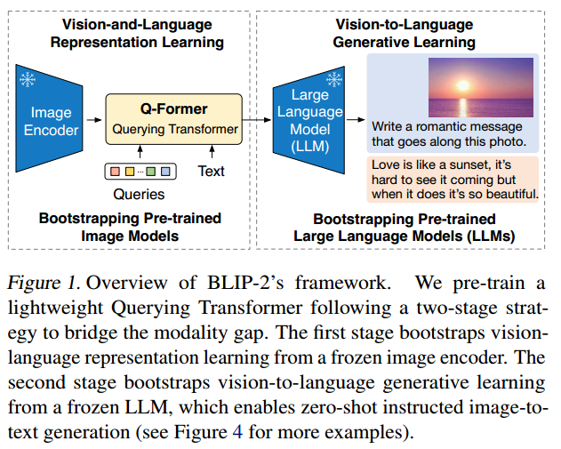
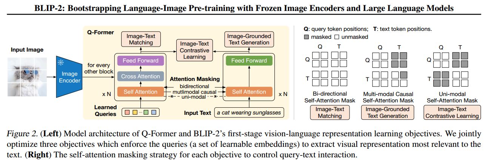
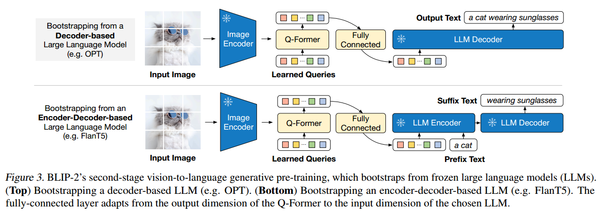
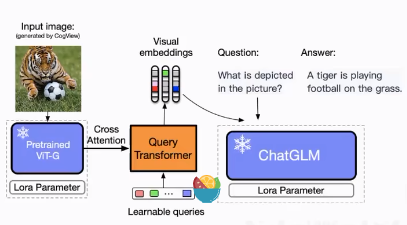

+++
author = "Yubao"
title = "多模态"
date = "2025-07-06"
description = "多模态"
tags = [
    "多模态",
    "机器人",
]
categories = [
    "机器人",
]
series = ["series_robotics"]
aliases = ["aliases_robotics"]
image = "https://picx.zhimg.com/70/v2-c1c5b8f8b29bb89b15ce2c0d5c01dd8b_1440w.avis?source=172ae18b&biz_tag=Post"
+++

## CLIP

[1] A. Radford *et al.*,  Learning Transferable Visual Models From Natural Language Supervision,  Feb. 26, 2021, *arXiv*: arXiv:2103.00020. Accessed: May 22, 2024. https://github.com/openai/CLIP

CLIP的核心思想是通过海量的**弱监督**文本对通过**对比学习**，将图片和文本通过各自的预训练模型获得的编码向量在向量空间上对齐。

- 弱监督： 文本与图像之间并不是特别匹配。

- 图文匹配

- 无法完成生成任务

## BLIP

[1] J. Li, D. Li, C. Xiong, and S. Hoi,  BLIP: Bootstrapping Language-Image Pre-training for Unified Vision-Language Understanding and Generation,  Feb. 15, 2022, *arXiv*: arXiv:2201.12086. 

BLIP的一大贡献在于将**自然语言理解**和**自然语言生成任务**进行了融合形成了多模态通用模型。

- 可以完成生成任务，输入图片可生成文本。

- 相同颜色的模块共享参数

- [CLS] 代表它是一个分类任务

- Bi Self-Att双向自注意力机制

- ITC 做对比学习，图文匹配，使得文本向量与图像向量尽可能对齐，这个对比学习是粗粒度的，后面还有ITM

- 第三列中的cross Attention融合了文本与图像特征

- ITM: 是个二分类任务，正样本与负样本

- LM：是个生成任务, 看图生成文字

BLIP的另一个贡献在于弱监督图文数据清洗方面，通过训练模型剔除了图文匹配差以及对部分图片生成了更好的文本标注。

## BLIP2

[1] J. Li, D. Li, S. Savarese, and S. Hoi,  BLIP-2: Bootstrapping Language-Image Pre-training with Frozen Image Encoders and Large Language Models,  Jun. 15, 2023, *arXiv*: arXiv:2301.12597. 

BLIP2分为两个阶段的进行训练，左边是一个表征学习，右边是一个生成学习。阶段一获得高质量的图文对齐向量表征，阶段二通过向量表征进行文字生成。

冻住两个编码器，训练Q-Former桥,  在保证图像信息的前提下，变成一个向量，而且这个向量是与文本向量对齐的，这个向量可以被语言模型所理解。

在第一阶段通过ITC， ITM， IGT三个损失函数获得了很好的图片文本对方向量表征能力，重要的是仅训练班Qformer中很少的参数。

第二阶段将Qformer进行对齐后的表征向量基映射到大语言模型中，使模型获得图片信息，并进行指令微调。

全连接的主要目的是改变形状，输出的向量能够直接给LLM

## VisualGLM

https://github.com/THUDM/VisualGLM-6B/tree/main

# References

- [多模态+知识图谱 完全自学从零构建知识图谱](https://www.bilibili.com/video/BV1YEeweMEJY/?spm_id_from=333.788.recommend_more_video.4&vd_source=f6aa186edd20e449545aecf6d36f2e08)

- [VisualGLM技术讲解](https://www.bilibili.com/video/BV14L411q7fk/?vd_source=f6aa186edd20e449545aecf6d36f2e08)